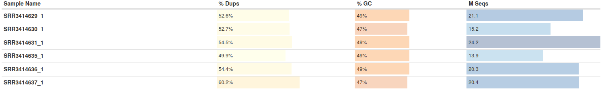
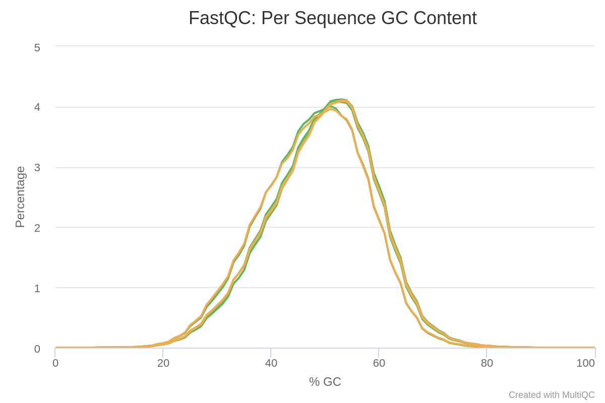
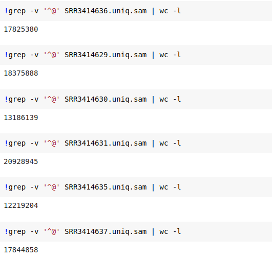
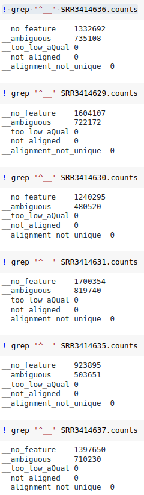

# hse21_hw3  
## Часть 1
### Ссылка на коллаб для 1 части задания-* https://colab.research.google.com/drive/1O039qWJhQQzcikuRNy4WBOfh3M70WTzJ?authuser=2#scrollTo=IsQ33PGc435z
### Проверка качества чтений из fastQC:
  
.png)  
  
.png)   
  
  
.png)  
### Итоговая статистика
  
### Уникально откартированные чтения для всех образцов:  
  
### Смотрим сколько чтений не удалось приписать ни одному гену:
* __no_feature 1332692 – столько чтений соответствует участкам генома, где не аннотировано ни одного экзона
*  __ambiguous 735108 – столько чтений могут принадлежать разным генам
* Итого, общее число чтений, соответствующих хотя бы одному гену равно: 17825380 – 1332692 – 735108 = 15757580 Для каждого образца приводим эту статистику в отчете на Github 
* 
### С помощью данный, приведенных выше, можно посчитать количество чтений, соответствующих хотя бы одному гену 
  
### Объединяем файлы с прочтениями в один - all_counts (столбцы - образцы, при чем c1, c2, c3 - контрольные образцы; r1, r2, r3 - перепрограммированные образцы)  

## Часть 2
### Ссылка на GoogleCola(part 2: DESeq):* https://colab.research.google.com/drive/174aQET9h9qfX1d2BlBC1_sDz0-FJ09kn?usp=sharing
### plotMA

### HeatMap

### Графики со значениями "Normalized counts" в двух группах образцов
